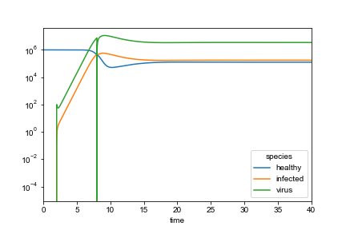

.. bulk_examples

=================
Bulk CRN Examples
=================

Predator Prey
-------------

This will be a step-by step explanation of setting up a basic predator-prey scenario.
First, import the library::

    from lblcrn.crn_sym import *
    from lblcrn.experiments.simulate import *

Then make your species manager. This is the object that keeps track of all
the information relating to species. See the docs here (TODO)::
    
    sm = SpeciesManager()

Using the species manager, you can declare as many species as desired as follows::

    x1 = sm.sp('x')
    x2 = sm.sp('y')

Then, given these species, arbitrary reaction systems can be created using the :code:`Rxn`,
:code:`Conc` and other classes detailed here (TODO)::

    rsys = RxnSystem(
        Rxn(x1 + x2, 2 * x2, 1.5),
        Rxn(x1, 2 * x1, 1),
        Rxn(x2, None, 1),
        Conc(x1, 2),
        Conc(x2, 1),
        sm
    )

Simply specify the reaction system, runtime, and other optional parameters to simulate the system::

    xps, ts = simulate(rsys, time=40, max_step=1e-2)

Given the simulated solution, a variety of different visualizations and analyses can be performed.
For example, the time series data can be plotted with the plot command::

    ts.plot()

.. image:: _static/img/bulk_crn/predator_prey_time_series.png
    :width: 400
    :alt: Predator-Prey time series data

HIV
---
This example is inspired from Nowak, M. and May, R. M. Virus dynamics: mathematical principles of
immunology and virology: mathematical principles of immunology and virology. Oxford university
press, 2000. It simulates the relationship between healthy and infected cells as HIV spreads
throughout the body. 

Simple chemical reaction language is used to describe the system: healthy cells are infected by the virus,
both infected and healthy cells as well as the virus die at various rates, healthy cells reproduce, healthy
cells and infected cells produce more of the virus. These simple relationships are specified and the
system automatically generates the necessary differential equations and correctly simulates the
scenario, matching the research mentioned before.

First create the species::

    sm = SpeciesManager()
    v = sm.sp('virus')
    h = sm.sp('healthy')
    inf = sm.sp('infected')

Then, create a reaction system using the relationships described earlier, adding in initial
population numbers for healthy cells and virus particles::

    rsys = RxnSystem(
        sm,
        Rxn(h + v, inf , 2e-7), 
        Rxn(inf, None, 0.5),
        Rxn(h, None, 0.2),
        Rxn(v, None, 5),
        Rxn(None, h, 1e5),
        Rxn(inf, v + inf, 100),
        
        Conc(h, 1000000),
        Conc(v, 100),
    )

The system can be quickly simulated for 45 time-steps with the :code:`simulate` function::

    xps, ts = simulate(rsys, 45, max_step=0.01)

The returned objects can be used to easily plot the time-series data. These plots can be adjusted
using any usual matplotlib functionality. For example, in this case, a log-log plot is desired so
can be constructed very simply::

    ts.plot()

    import matplotlib.pyplot as plt

    plt.yscale("log")
    plt.xlim(0,40)

.. image:: _static/img/bulk_crn/hiv_time_series.png
    :width: 400
    :alt: HIV time series data

HIV with a Schedule Function
----------------------------

The CRN system also supports custom concentration schedules (that simulate external input of species
after simulation begins). For example, continuing with the scenario of HIV, if the virus instead infects the
person at the second time-step and is completely removed a few time steps later, this situation can be
modeled using a schedule.

First create the species as before::

    sm = SpeciesManager()
    v = sm.sp('virus')
    h = sm.sp('healthy')
    inf = sm.sp('infected')

Then, create a reaction system, but use the :code:`Schedule` to specify the species that is on a
schedule and what that schedule is (a map of time step to concentration change)::

    rsys = RxnSystem(
        sm,
        Rxn(h + v, inf , 2e-7), 
        Rxn(inf, None, 0.5),
        Rxn(h, None, 0.2),
        Rxn(v, None, 5),
        Rxn(None, h, 1e5),
        Rxn(inf, v + inf, 100),
        
        Conc(h, 1000000),
        Schedule(v, {2: 100, 8:-8*1e6})
    )

The system can be simulated again and plotted to show how the virus concentration only rises after
it is introduced to the system, and any virus particles are completely removed at the eight
time-step::

    xps, ts = simulate(rsys, 45, max_step=0.01)

    ts.plot()

    import matplotlib.pyplot as plt

    plt.yscale("log")
    plt.xlim(0,40)

The returned time series object also includes additional helpful functionality: for example, an
ordinary pandas dataframe can be accessed for further analysis::
    
    ts.df

Moreover, concentrations for specific time-steps can be quickly accessed with the :code:`at`
function::

    ts.at(3)

H20 Adsorption and Complex Formation on Ag(111) 
-----------------------------------------------

While the bulk CRN can be used to investigate a multitude of phenomenon, it is specifically tailored
to simulate and predict the results of chemical reactions.

<Description of Scenario>

Firs create the species that are part of the reaction. The energies for various orbitals (used in
XPS spectra plotting) can be specified when creating the species::

    sm = SpeciesManager()

    y1 = sm.sp('H2Og', Orbital('1s', 535.0))
    x2 = sm.sp('H2O*', Orbital('1s', 532.2))
    x3 = sm.sp('OH*', Orbital('1s', 530.9))
    x4 = sm.sp('O*', Orbital('1s', 530.0))
    x53 = sm.sp('OH.H2O_hb', Orbital('1s', 531.6))
    x54 = sm.sp('O.H2O_hb', Orbital('1s', 531.6))
    x6 = sm.sp('multiH2O', Orbital('1s', 533.2))
    x7 = sm.sp('O2g', Orbital('1s', 535.0))

Then, following the chemical relationships, construct the reaction systems with chosen initial
concentrations::

    rsys = RxnSystem(
        Rxn(x4 + y1, x54, 3.207654),
        Rxn(x3 + y1, x53, 1.363342),
        RevRxn(x54, x3 + x3, 6.220646,0.160755),
        Rxn(x53, x2 + x3, 0.299507),
        Rxn(x54, x2 + x4, 0.167130),
        Rxn(x2, y1, 1.939313),
        Rxn(y1, x2, 0.515646),
        Rxn(x53, y1 + x3, 0.733491),
        Rxn(x54, x4 + y1, 0.311754),
        Rxn(x53 + y1, x6, 1.038423),
        Rxn(x6, x53 + y1, 0.962999),
        RevRxn(x4 + x4, x7, 0.002342,426.922895),
        Conc(y1,1),
        Conc(x4,0.25),
        sm
    )

A simple call to :code:`simulate` is all that is needed to simulate this complicated system::

    xps, ts = simulate(rsys, 500, max_step=1)

As with previous examples, the time-series data can be plotted::

    ts.plot()

.. image:: _static/img/bulk_crn/ag_time_series.png
    :width: 400
    :alt: H20 Adsorption and Complex Formation on Ag(111) time series data

However, given the chemical context, a predicted XPS spectra can also be plotted using the xps
return value from :code:`simulate`. Using the supplied orbital values, Gaussian peaks can be plotted
for all species::

    xps.plot()

.. image:: _static/img/bulk_crn/ag_xps.png
    :width: 400
    :alt: H20 Adsorption and Complex Formation on Ag(111) XPS Spectra
